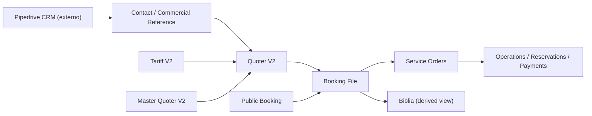

# Domain Map

## Vista general

## Dominios actuales

### CRM externo / Pipedrive

#### Que existe en codigo

- no encontre evidencia de integracion actual

#### Rol esperado

- CRM comercial principal
- origen de leads, deals, activities y pipeline

#### Decision

- no duplicar CRM dentro del sistema

### Contact / Commercial Reference

#### Que existe

- `Contact`
- ownership comercial basico
- estados simples
- cotizaciones relacionadas

#### Rol correcto

- referencia local minima para cotizacion y operacion
- enlace local con el CRM externo

#### Diagnostico

- no deberia seguir creciendo como mini-CRM

### Quoter

#### Que existe

- `QuoterV2`
- pricing
- exportacion
- confirm sale
- revert sale
- review agent

#### Rol correcto

- cotizacion comercial-operativa
- no reemplaza CRM
- no reemplaza el expediente central postventa

### Master Quoters

#### Que existe

- templates por dia
- items referenciando tarifas
- separacion `services` y `options`

#### Rol correcto

- plantilla reusable
- no reemplaza el `QuoterV2`

### Tariff

#### Que existe

- catalogo estructurado de costos
- vigencias
- pricing modes
- child policies

#### Rol correcto

- source of truth de costos

### Booking File

#### Que existe

- expediente central del viaje vendido
- snapshot comercial
- snapshot operativo
- estados por area
- riesgo
- next action

#### Rol correcto

- hub postventa

### Service Orders

#### Que existe

- ordenes por area y tipo
- workflow por template
- checklist
- attachments
- financials

#### Rol correcto

- unidad ejecutable por area

### Biblia

#### Que existe

- vista diaria derivada desde `BookingFile.operational_itinerary` + `ServiceOrder`

#### Rol correcto

- vista operativa derivada
- no fuente primaria

### Public Booking

#### Que existe

- links publicos temporales
- submit de pasajeros
- pasaportes a S3
- integracion con Power Automate

#### Rol correcto

- captura postventa de informacion

## Relaciones clave

| Origen | Relacion | Destino | Observacion |
| --- | --- | --- | --- |
| `Pipedrive` | should sync/reference | `Contact` | frontera externa aun no implementada |
| `User` | owns | `Contact` | ownership comercial basico |
| `Role` | grants | `User` | permisos y scopes |
| `Contact` | has many | `QuoterV2` | referencia comercial local |
| `QuoterV2` | consumes | `TariffItemV2` | via `tariff_item_id` |
| `MasterQuoterV2` | references | `TariffItemV2` | buena reutilizacion |
| `QuoterV2` sold | creates | `BookingFile` | flujo clave de negocio |
| `BookingFile` | has many | `ServiceOrder` | clave del post-sales |
| `ServiceOrderTemplate` | configures | `ServiceOrder` | SLA, checklist, stages |
| `BookingFile` | derives | `Biblia` | correcto |

## Mapa de estados

### Comercial local

- `Contact.status`
- `Contact.cotizations[].status`
- `QuoterV2.status`

Diagnostico:

- util como soporte local
- no debe competir con el pipeline de Pipedrive

### Operativo

- `BookingFile.overall_status`
- `operations_status`
- `reservations_status`
- `payments_status`
- `deliverables_status`
- `risk_level`

Diagnostico:

- mejor modelado que la capa comercial local

### Ordenes

- `ServiceOrder.status`
- `currentStageCode`
- `accountingStatus`
- `financials.paymentStatus`

Diagnostico:

- base buena para crecer

## Estrategia recomendada por dominio

### Mantener y consolidar

- `TariffV2`
- `BookingFile`
- `ServiceOrder`
- `Biblia`
- `QuoterV2`

### Refactorizar gradualmente

- `Contact`
- `QuoterV2` form
- `User/Role/Auth`
- capa de integraciones externas

### Crear despues de consolidar

- `AuditLog`
- `IntegrationAdapter` para Pipedrive
- `IntegrationLog`
- `AccountingLite`

## Decision arquitectonica resumida

- `File` debe seguir siendo el expediente central del viaje vendido.
- `Biblia` debe seguir siendo derivada.
- `Tariff` debe seguir siendo la fuente primaria de costos.
- `Master Quoters` deben seguir siendo plantillas reutilizables.
- `Service Orders` deben seguir derivandose del viaje vendido.
- Pipedrive debe ser el CRM principal.
- Este sistema debe integrarse con el CRM, no reemplazarlo.
