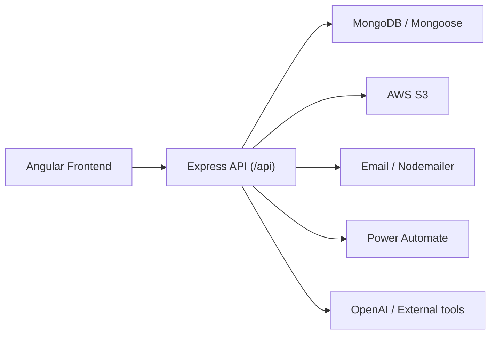
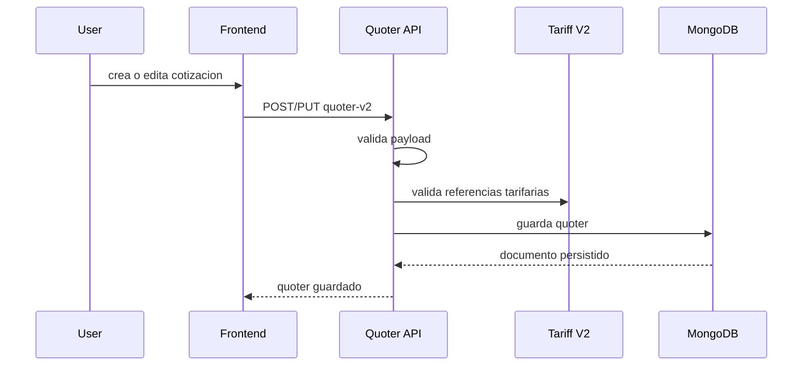
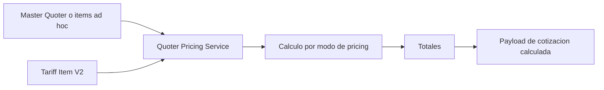
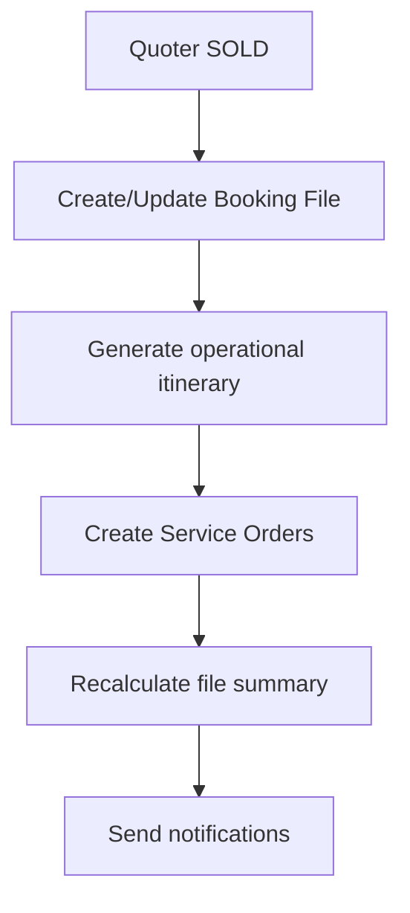
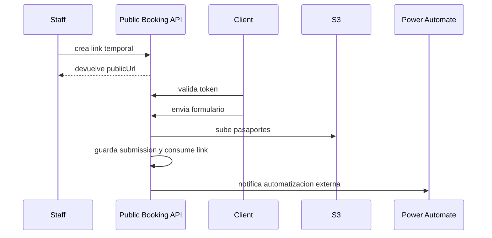

# System Architecture Programming Guide

## Objetivo

Este documento explica como esta construido el sistema a nivel de programacion:

- arquitectura general
- estructura del frontend y backend
- modulos funcionales
- modelos de datos principales
- autenticacion y permisos
- flujos de negocio importantes
- integraciones externas
- puntos fuertes y deuda tecnica actual

La idea es que una persona nueva pueda leer este archivo y entender:

1. que resuelve el sistema
2. como estan conectadas sus piezas
3. por donde empezar a leer el codigo
4. que pasa cuando se ejecutan los flujos mas importantes

## 1. Que hace el sistema

Este sistema es una plataforma interna para una operacion turistica/comercial.

Su funcion principal es cubrir el ciclo operativo desde la cotizacion hasta la ejecucion del viaje:

1. administrar tarifas
2. construir cotizaciones
3. reutilizar plantillas de cotizacion
4. confirmar ventas
5. crear un expediente operativo del viaje vendido
6. generar ordenes de trabajo para reservas, operaciones y control financiero
7. capturar informacion del pasajero via formulario publico
8. dar seguimiento diario a la operacion

En terminos de negocio, el sistema esta organizado alrededor de estos dominios:

- `Tariff V2`
- `Quoter V2`
- `Master Quoter V2`
- `Booking File`
- `Service Orders`
- `Public Booking`
- `Biblia`
- `Users / Roles / Permissions`

## 2. Vista general de arquitectura

La solucion esta dividida en dos aplicaciones hermanas:

- `frontend/`: Angular 18
- `back-end/`: Express + MongoDB

No es un monorepo con tooling compartido. Es un proyecto fullstack separado por carpetas y conectado por contratos HTTP.



## 3. Estructura del repositorio

```text
frontend/
  src/app/
    Services/
    components/
    features/
    operations/
    pages/
    pages-quoter/
  docs/

back-end/
  index.js
  db/
  src/
    Rutas/
    Services/
    middlewares/
    models/
    modules/
    security/
    utils/
```

## 4. Stack tecnico

### Frontend

- Angular 18
- Standalone components
- Angular Router
- Angular Forms
- Angular Material / CDK
- Tailwind CSS
- ngx-translate
- SweetAlert2 / ngx-sonner
- Firebase (presente en dependencias)

### Backend

- Node.js
- Express
- MongoDB
- Mongoose
- JWT
- Multer
- AWS S3 SDK
- Nodemailer

## 5. Arquitectura del frontend

## 5.1 Entrada principal

El frontend arranca con:

- `src/main.ts`
- `src/app/app.config.ts`
- `src/app/app.routes.ts`

La aplicacion usa rutas lazy por pantalla y una estructura principal bajo `dashboard`.

### Rutas principales

- `dashboard/quoter-main/...`
- `dashboard/tariff-v2`
- `dashboard/manageUsers`
- `dashboard/operations/...`
- `booking-form-public/:token`
- `login`

## 5.2 Zonas del frontend

### `components/`

Contiene layout y piezas compartidas:

- login
- header
- footer
- sidebar
- spinner
- layout

### `Services/`

Contiene servicios HTTP y autenticacion.

Ejemplos:

- `AuthService`
- `quoter-v2.service.ts`
- `tariff-v2.service.ts`
- `booking-public.service.ts`
- `users.service.ts`
- `roles.service.ts`

Es una zona mas legacy, pero sigue siendo importante porque mucho del frontend se apoya en ella.

### `pages-quoter/`

Contiene gran parte del flujo comercial:

- formulario de quoter
- listado de quoters
- booking form interno
- master quoter
- modales relacionados

Es una mezcla de UI y logica historica del sistema.

### `features/`

Es la parte mas moderna del frontend.

Las features nuevas siguen un patron mas limpio:

- `data-access/`
- `pages/`
- `ui/`

Ejemplos:

- `features/service-orders`
- `features/booking-files`

### `operations/`

Pantallas operativas derivadas del expediente y de las ordenes:

- `biblia`
- `reservas-status`
- `guide-transport-assignment`

## 5.3 Navegacion funcional

La navegacion esta separada de las rutas reales mediante `navigation.config.ts`.

Eso permite que el menu refleje modulos de negocio y no solo paths tecnicos.

Los grupos principales son:

- `Tarifas`
- `Ventas`
- `Operaciones`
- `Administracion`

## 5.4 Estado y patron de datos en frontend

No existe un store global unico tipo NgRx.

El frontend mezcla varios enfoques:

- servicios HTTP tradicionales
- `signal()` y `computed()` en componentes nuevos
- estado local en formularios reactivos
- stores feature-specific como `ServiceOrdersStore`

En las features nuevas, el patron dominante es:

1. `Api` para llamadas HTTP
2. `Store` para estado de pantalla
3. `Page` para orquestar
4. `UI` components para render

Ese enfoque es mas mantenible que las pantallas legacy y conviene seguirlo en nuevas mejoras.

## 6. Arquitectura del backend

## 6.1 Entrada principal

El backend inicia en `back-end/index.js`.

Ahi se configuran:

- express
- middlewares globales
- conexion a MongoDB
- CORS
- montaje de rutas

Todas las rutas se montan bajo `/api`.

## 6.2 Registro de rutas

La composicion principal vive en:

- `back-end/src/Rutas/index.js`

Hay dos estilos coexistiendo:

### Estilo legacy

Rutas bajo `src/Rutas/*`

Ejemplos:

- `User`
- `Contact`
- `Roles`
- `PublicBooking`
- `ServiceOrders`
- `BookingFiles`

### Estilo modular mas nuevo

Modulos bajo `src/modules/*`

Ejemplos:

- `quoter-v2`
- `master-quoter-v2`
- `tariff-v2`
- `itinerary`
- `itinerary-launch`

Cada modulo nuevo suele venir separado por capas:

- `api/`
- `application/`
- `domain/`
- `infrastructure/`

## 6.3 Capas del backend

### `api/`

Expone rutas y controladores HTTP.

Responsabilidades:

- leer `req`
- validar ids y payloads
- llamar servicios
- transformar respuesta HTTP
- mapear errores a status codes

### `application/`

Contiene servicios de negocio de un modulo.

Responsabilidades:

- reglas de negocio
- orquestacion
- validaciones de aplicacion
- calculos
- transformaciones

### `domain/`

Contiene tipos, enums y reglas del dominio.

### `infrastructure/`

Contiene persistencia concreta, sobre todo esquemas de Mongoose.

### `Services/`

Contiene servicios transversales o dominios legacy que no viven aun en `modules/`.

Ejemplos:

- `service-orders`
- `booking-files`
- `contacts`
- `mailer`

### `models/`

Contiene esquemas Mongoose legacy o compartidos.

### `security/`

Contiene:

- catalogo de permisos
- politicas de acceso

### `middlewares/`

Contiene:

- autenticacion
- manejo de errores

### `utils/`

Contiene helpers reutilizables:

- validacion
- errores HTTP
- uploads

## 7. Dominios principales y responsabilidades

## 7.1 Tariff V2

Es la fuente primaria de costos.

Responsabilidades:

- almacenar tarifas estructuradas
- vigencias
- modos de pricing
- providers
- ciudades
- child policies
- temporadas
- precios por habitacion, persona, grupo, rango o custom

Es el dominio que alimenta el calculo economico de las cotizaciones.

## 7.2 Master Quoter V2

Es una plantilla reusable de viaje/cotizacion.

Responsabilidades:

- definir dias
- asociar items tarifarios a cada dia
- separar `services` y `options`
- reutilizar estructura base para nuevas cotizaciones

No reemplaza al quoter. Lo acelera.

## 7.3 Quoter V2

Es la cotizacion principal.

Responsabilidades:

- guardar servicios, hoteles, vuelos, operadores y cruceros
- calcular precios
- relacionarse con tarifas
- exportar informacion
- confirmar una venta
- revertir una venta
- ejecutar review automatizada

Es el puente entre ventas y operaciones.

## 7.4 Booking File

Es el expediente central del viaje vendido.

Responsabilidades:

- snapshot comercial
- snapshot del itinerario
- itinerario operativo editable
- estados por area
- riesgo
- siguiente accion
- linkage con service orders

Conceptualmente es el hub postventa del sistema.

## 7.5 Service Orders

Es la unidad ejecutable por area.

Responsabilidades:

- representar trabajo concreto
- asignar responsables
- manejar status
- manejar etapas
- manejar checklist
- manejar adjuntos
- manejar datos financieros basicos
- dejar audit logs

Son las tareas reales que ejecuta la empresa despues de vender.

## 7.6 Public Booking

Es el formulario publico que llena el cliente o pasajero.

Responsabilidades:

- links temporales
- validacion de token
- recoleccion de pasajeros
- pasaportes y archivos
- notificacion posterior

## 7.7 Biblia

Es una vista operativa derivada.

No es fuente primaria de datos.

Se construye a partir de:

- `BookingFile.operational_itinerary`
- `ServiceOrder`

Sirve para lectura diaria y coordinacion.

## 8. Modelos de datos clave

## 8.1 Booking File

Campos conceptualmente importantes:

- `quoter_id`
- `contact_id`
- `fileCode`
- `sales_snapshot`
- `itinerary_snapshot`
- `operational_itinerary`
- `overall_status`
- `operations_status`
- `reservations_status`
- `payments_status`
- `deliverables_status`
- `passenger_info_status`
- `summary_context`
- `risk_level`
- `next_action`
- `service_order_ids`

Este modelo concentra la fotografia operativa del viaje.

## 8.2 Service Order

Campos conceptualmente importantes:

- `file_id`
- `contactId`
- `soldQuoterId`
- `businessEventId`
- `idempotencyKey`
- `area`
- `type`
- `status`
- `priority`
- `assigneeId`
- `workflowTemplateId`
- `currentStageCode`
- `stagesSnapshot`
- `checklist`
- `sourceSnapshot`
- `financials`
- `attachments`
- `auditLogs`

Este modelo permite trazabilidad y ejecucion controlada.

## 8.3 PublicBookingLink

Representa el acceso temporal a un formulario publico.

Campos esperados:

- hash del token
- `clientId`
- expiracion
- estado
- submission
- `usedAt`

## 9. Autenticacion y permisos

## 9.1 Autenticacion

La autenticacion principal usa JWT.

Flujo:

1. login desde frontend
2. backend devuelve token
3. frontend guarda token en `localStorage`
4. `auth.interceptor` lo envia en requests
5. backend valida token en middleware

Tambien existen tokens delegados para el bridge de itinerarios.

## 9.2 Permisos

Hay dos niveles:

### Frontend

- `authGuard`
- metadata en rutas
- directivas para permisos/roles

### Backend

- middleware de auth
- `authorizePermissions`
- validaciones por servicio en modulos sensibles

Los permisos estan catalogados en `src/security/permissions.js`.

Ejemplos:

- `view_quoter`
- `view_tariff`
- `view_users`
- `service_orders.assign`
- `service_orders.stage.update`
- `service_orders.financials.manage`

Regla importante:

El frontend ayuda a ocultar o bloquear acceso, pero la seguridad real debe vivir en backend.

## 10. Flujos de trabajo principales

## 10.1 Flujo de cotizacion



### Detalles tecnicos

- el quoter puede referenciar items de tarifa
- backend normaliza contratos legacy
- backend valida ids de tarifa antes de persistir
- si no existe contacto local, puede crearlo

## 10.2 Flujo de pricing



El motor de pricing soporta varios modos:

- `PER_PERSON`
- `PER_GROUP`
- `PER_PAX_RANGE`
- `PER_ROOM`
- `PER_SEASON`
- `CUSTOM`

Tambien resuelve:

- vigencias
- fechas especiales
- child policies
- habitaciones
- vehicle selection

## 10.3 Confirmacion de venta

Este es uno de los flujos mas importantes del sistema.

Cuando una cotizacion se confirma como vendida, el backend:

1. valida `fileCode`
2. busca o crea el `BookingFile`
3. genera snapshots comercial y operativo
4. marca el quoter como `SOLD`
5. actualiza el `Contact`
6. crea `Service Orders` derivadas
7. recalcula resumen del `Booking File`
8. intenta disparar notificaciones



Este flujo es la bisagra entre ventas y ejecucion.

## 10.4 Generacion automatica de Service Orders

La orquestacion toma una cotizacion vendida y extrae lineas de trabajo desde:

- hoteles
- servicios
- vuelos
- operadores
- cruceros
- controles financieros

Luego genera ordenes por tipo:

- `HOTEL`
- `TOUR`
- `TRANSPORT`
- `TICKETS`
- `PREPAYMENT`
- `INVOICE`

Cada orden:

- hereda snapshot de origen
- busca template activo por tipo
- genera checklist
- genera stages
- calcula `dueDate` por SLA
- crea un `idempotencyKey`

El `idempotencyKey` evita duplicados si el flujo se vuelve a ejecutar.

## 10.5 Booking File summary

El sistema recalcula el resumen operativo del expediente para derivar:

- estado general
- estado de reservas
- estado de operaciones
- estado de pagos
- estado de entregables
- riesgo
- siguiente accion
- contadores de ordenes abiertas, vencidas y bloqueadas

Esto convierte datos dispersos en una lectura ejecutiva del viaje.

## 10.6 Flujo de Public Booking



### Comportamiento tecnico

- el link usa token hasheado
- tiene expiracion
- se invalida si ya fue usado
- los archivos se almacenan en S3
- el backend notifica a Power Automate al terminar

## 10.7 Flujo operativo diario

Las pantallas de operaciones consumen principalmente:

- `Booking Files`
- `Service Orders`
- `Biblia daily view`

### `Reservas`

Muestra ordenes del area `RESERVAS`.

Sirve para:

- ver que esta pendiente
- cambiar estados
- navegar al expediente o al conjunto de ordenes del contacto

### `Asignaciones`

Muestra ordenes del area `OPERACIONES`.

Sirve para:

- agrupar por fecha
- detectar asignaciones pendientes
- navegar al expediente o al contacto

### `Biblia`

Muestra una vista operacional diaria derivada del expediente.

Sirve para:

- leer agenda del dia
- revisar horarios
- detectar faltantes
- abrir el expediente o las ordenes relacionadas

## 11. Integraciones externas

## 11.1 AWS S3

Se usa para:

- archivos de pasaporte en `Public Booking`
- adjuntos de `Service Orders`

El backend genera presigned URLs en algunos flujos y en otros aun hace upload directo.

## 11.2 Power Automate

Se usa despues del submit del formulario publico para disparar automatizaciones externas.

## 11.3 Email

Se usa para notificaciones, sobre todo al confirmar una venta.

## 11.4 OpenAI

Existe un servicio de review para cotizaciones.

No es el eje del sistema, pero funciona como una ayuda automatizada para revisar calidad o consistencia de un quoter.

## 12. Patrones de codigo importantes

## 12.1 Validacion

El backend usa utilidades propias de validacion.

Patron comun:

1. validar que el body sea objeto plano
2. validar enums, strings, arrays, ids y fechas
3. cortar la request antes de ejecutar negocio

Esto esta mejor desarrollado en modulos nuevos que en rutas legacy.

## 12.2 Error handling

El backend usa helpers como:

- `createHttpError`
- `sendError`

La idea es estandarizar:

- status
- mensaje
- codigo interno

En frontend tambien hay interceptors para errores y spinner.

## 12.3 Idempotencia

El mejor ejemplo es la creacion de service orders a partir de una venta:

- se construye `businessEventId`
- se construye `idempotencyKey`
- se usa `findOneAndUpdate` con `$setOnInsert`

Eso protege contra duplicados por reintentos.

## 12.4 Snapshots

El sistema usa snapshots para congelar contexto de negocio en el tiempo.

Ejemplos:

- `sales_snapshot`
- `itinerary_snapshot`
- `sourceSnapshot` de `ServiceOrder`

Esto es importante porque las tarifas o la estructura del quoter pueden cambiar despues, pero la operacion necesita conservar el contexto original del viaje vendido.

## 13. Como leer el codigo por primera vez

Si alguien nuevo quiere entender el sistema, este es el orden recomendado:

1. leer `frontend/src/app/app.routes.ts`
2. leer `frontend/src/app/navigation/navigation.config.ts`
3. leer `back-end/src/Rutas/index.js`
4. leer `back-end/src/modules/quoter-v2/api/quoter-v2.controller.js`
5. leer `back-end/src/Services/service-orders/service-order.orchestrator.js`
6. leer `back-end/src/models/booking_file.schema.js`
7. leer `back-end/src/models/service_order.schema.js`
8. leer `back-end/src/Services/booking-files/booking-file-summary.service.js`
9. leer `back-end/src/Rutas/PublicBooking/publicBooking.route.js`

## 14. Convenciones actuales del proyecto

## 14.1 Frontend

- mezcla de folders legacy y feature-based
- nuevas features intentan usar `data-access/pages/ui`
- uso de `signals` en modulos nuevos
- formularios reactivos en flujos complejos

## 14.2 Backend

- modulos nuevos tienen mejor separacion por capas
- rutas legacy aun conviven con la arquitectura nueva
- modelos Mongoose viven tanto en `models/` como dentro de `modules/`

## 15. Puntos fuertes de la arquitectura actual

- el sistema ya representa el flujo real del negocio
- `Tariff -> Quoter -> Booking File -> Service Orders` es una cadena coherente
- el `Booking File` esta bien conceptualizado como expediente central
- `Service Orders` tienen base buena para crecer operativamente
- hay automatizacion real al confirmar una venta
- el sistema usa snapshots e idempotencia en puntos importantes
- las features nuevas del frontend tienen mejor estructura

## 16. Limites y deuda tecnica actual

## 16.1 Mezcla de estilos

Hay mezcla entre:

- frontend legacy y frontend moderno
- backend modular y backend legacy

Eso sube la curva de mantenimiento.

## 16.2 Seguridad desigual

Hay permisos en frontend y backend, pero no todos los modulos parecen endurecidos con el mismo nivel.

## 16.3 Testing insuficiente

El backend no tiene una suite real de tests automatizados.

## 16.4 Integraciones acopladas

Algunas integraciones estan disparadas directamente desde requests HTTP:

- email
- Power Automate
- uploads

Eso hace fragil el flujo si falla una dependencia externa.

## 16.5 Carga de datos operativos

Algunas pantallas de operaciones cargan muchos registros y filtran bastante en frontend.

Eso puede volverse costoso con mas volumen.

## 17. Hacia donde conviene evolucionar

Sin reescribir el sistema completo, la direccion tecnica mas sana es:

1. consolidar `Booking File` como centro operativo
2. endurecer permisos en backend
3. mover integraciones criticas a jobs o colas
4. seguir migrando pantallas nuevas al patron `feature/data-access/pages/ui`
5. formalizar observabilidad y tests
6. separar mejor la frontera con el CRM externo

## 18. Resumen ejecutivo tecnico

Este sistema no es una app CRUD simple.

Es un monolito fullstack modular en transicion, construido para soportar un flujo turistico operativo real:

- costos estructurados
- cotizacion compleja
- venta
- apertura automatica de expediente
- ejecucion por ordenes de trabajo
- captura de datos de pasajero
- seguimiento operativo diario

La pieza central de su arquitectura no es el `Quoter`, sino la cadena completa:

`Tariff -> Quoter -> Booking File -> Service Orders -> Operations Views`

Quien entienda esa cadena, entiende el sistema.
