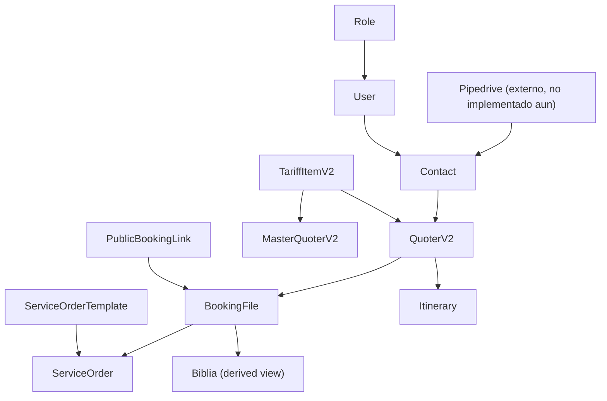

# System Audit: Luxury Travel Platform

Fecha: 2026-04-17

## Resumen ejecutivo

El sistema actual tiene una base real y aprovechable para operar como plataforma interna de cotizacion y ejecucion para una agencia de viajes de lujo. No conviene reescribirlo. Conviene consolidarlo.

Fortalezas reales encontradas:

- `tariff-v2` esta bien modelado y es el mejor candidato a source of truth de costos
- `master-quoter-v2` ya funciona como plantilla reusable conectada a tarifas
- `quoter-v2` ya cubre CRUD, pricing, exportacion, confirmacion de venta y un primer review agent con OpenAI
- `booking_file` esta bien orientado como expediente central del viaje vendido
- `service_order` es la base mas madura del sistema operativo
- `biblia` ya funciona como vista derivada, no como fuente primaria

Debilidades principales:

- no encontre evidencia de integracion actual con Pipedrive
- `Contact` aun arrastra responsabilidades comerciales historicas
- contabilidad no existe como dominio consolidado
- hay mezcla de arquitectura moderna y legacy tanto en frontend como backend
- seguridad, testing, observabilidad y hardening todavia no estan a nivel produccion robusta

Conclusion:

- la plataforma esta avanzada en quoting y operaciones
- el CRM debe quedar fuera del sistema y vivir en Pipedrive
- el siguiente paso no es crear mas ventas internas, sino cerrar finanzas minimas, soporte operativo e integracion externa

## Nota de alcance actual

Este documento reemplaza la idea de un CRM interno como objetivo principal.

Desde hoy, la decision recomendada es:

- Pipedrive sera el CRM comercial principal
- este sistema se enfocara en quoter, tariff, file, service orders, biblia e integraciones
- cualquier capa comercial local debe ser minima y subordinada a la integracion con el CRM externo

No encontre evidencia suficiente en el codigo de una integracion ya implementada con Pipedrive.

## Alcance y evidencia revisada

Se reviso evidencia real en:

- frontend Angular 18: rutas, navegacion, guards, interceptors, servicios, pantallas y features
- backend Express/Mongoose: rutas, middlewares, seguridad, modelos, modulos y servicios operativos
- configuracion: `package.json`, `angular.json`, environments, `firebase.json`, proxy, seed script
- documentos internos de auditoria y backlog

No encontre evidencia suficiente de:

- suite de tests util en backend
- CI/CD real
- observabilidad
- metricas
- integracion con Pipedrive
- modulo contable consolidado

## Arquitectura real del proyecto

### Frontend

Stack confirmado:

- Angular 18 standalone
- Tailwind CSS
- Angular CDK/Material parcial
- Signals en modulos nuevos

Patron real:

- arquitectura hibrida
- capas legacy en `pages-quoter`, `Services`, `operations`
- capas mas modernas en `features/service-orders` y `features/booking-files`

Fortalezas:

- lazy loading por dominios
- guard por permisos
- navegacion por areas de negocio
- features nuevas con mejor separacion `data-access/ui/pages`

Debilidades:

- uso frecuente de `any`
- formularios muy grandes
- mezcla de servicios viejos y stores modernos
- sin estado global consistente

### Backend

Stack confirmado:

- Node.js + Express
- MongoDB + Mongoose

Patron real:

- modulos nuevos con estructura `api/application/infrastructure/domain`
- rutas legacy con logica embebida

Dominios mejor resueltos:

- `tariff-v2`
- `master-quoter-v2`
- `quoter-v2`
- `service-orders`
- `booking-files`

Dominios mas debiles:

- `contacts`
- `users/roles/auth`
- base financiera
- integraciones externas normalizadas

## Inventario del sistema actual

### Capa comercial

Estado: `Parcial y de soporte local`

Si existe:

- `contacts`
- cotizaciones por contacto
- estados comerciales basicos `WIP/HOLD/SOLD/LOST`
- listado comercial y kanban simple

No debe interpretarse como:

- CRM completo
- pipeline comercial definitivo
- reemplazo de Pipedrive

Diagnostico:

- la capa comercial local sirve como soporte al quoter
- no conviene expandirla hacia leads, deals y activities internas

### Quoter

Estado: `Parcial alto`

Si existe:

- `quoter-v2` CRUD
- pricing backend
- form de edicion
- listado y exportacion PDF/Excel
- confirm sale / revert sale
- review agent con OpenAI

Brechas:

- versionado todavia simple
- form complejo
- cobertura de tests insuficiente

### Master Quoters

Estado: `Parcial alto`

Si existe:

- templates por dia
- referencias a `tariff-v2`
- separacion `services` y `options`
- endpoint `resolved`

Falta:

- versionado mas fuerte si negocio realmente lo necesita

### Tarifario

Estado: `Completo para la etapa actual`

Si existe:

- tipos y categorias
- vigencias
- temporadas
- child policies
- pricing modes
- filtros y catalogo

Es el modulo mejor resuelto del sistema.

### Operaciones

Estado: `Parcial alto`

Si existe:

- `booking-files`
- `service-orders`
- `service-order-templates`
- `operational itinerary`
- `biblia`

Falta o esta debil:

- rooming
- incidencias
- timeline operativo con SLA mas robusto

### Controles financieros

Estado: `Parcial bajo`

Si existe:

- ordenes `PREPAYMENT` e `INVOICE`
- `financials` en service orders
- payment status en ordenes y files

No existe:

- cuentas por cobrar consolidadas
- cuentas por pagar consolidadas
- conciliacion
- margen real consolidado

### Biblia

Estado: `Bien resuelto conceptualmente`

Hallazgo:

- ya se construye como vista derivada desde `BookingFile.operational_itinerary` y `ServiceOrder`

### Usuarios, roles y seguridad

Estado: `Parcial`

Si existe:

- `User`
- `Roles`
- catalogo de permisos
- route guard frontend
- permisos operativos para service orders

Brechas:

- JWT en `localStorage`
- autorizacion inconsistente en backend
- falta auditoria transversal

### Automatizaciones

Estado: `Parcial`

Si existe:

- `confirmSale` crea `BookingFile`
- `confirmSale` genera `ServiceOrders`
- `BookingFileSummaryService` recalcula estados y riesgo
- `PublicBookingLink` captura informacion de pasajeros

No existe:

- scheduler/queue real
- recordatorios SLA
- avisos automaticos de pagos

### Integraciones externas

Estado: `Parcial`

Si existe:

- OpenAI
- S3
- Power Automate

No encontre:

- Pipedrive

## Entidades y relaciones reales

### Entidades centrales

#### `Contact`

Estado: `Existe pero necesita acotarse`

Hoy actua como:

- contacto local
- soporte comercial historico
- agregador de cotizaciones
- puntero a la venta ganada

Diagnostico:

- debe quedar como referencia local enlazable a CRM externo

#### `QuoterV2`

Estado: `Bien orientado, mejorable`

Hoy actua como:

- cotizacion comercial-operativa
- documento persistido con servicios, hoteles, vuelos, operadores y cruceros
- soporte de pricing y venta

Diagnostico:

- base solida, con trabajo reciente de consistencia

#### `TariffItemV2`

Estado: `Bien resuelto`

Diagnostico:

- es el mejor source of truth del proyecto

#### `BookingFile`

Estado: `Muy bien orientado`

Diagnostico:

- debe consolidarse como expediente central del viaje vendido

#### `ServiceOrder`

Estado: `Muy bien orientado`

Diagnostico:

- es la mejor base actual para ejecucion por areas

## Flujos reales encontrados

### Flujo comercial-operativo local

1. Se crea o selecciona `Contact`.
2. Se crea `QuoterV2`.
3. Se edita y exporta.
4. Al vender:
   - `QuoterV2` pasa a `SOLD`
   - se crea o actualiza `BookingFile`
   - se congela snapshot vendido
   - se genera `operational_itinerary`
   - se crean `ServiceOrders`
   - se recalcula summary del file

Este flujo si existe y es el activo principal del sistema.

### Flujo operativo

1. `BookingFile` concentra el viaje vendido.
2. `ServiceOrders` se derivan desde la venta.
3. `BookingFileSummaryService` calcula estados, riesgo y next action.
4. `BookingFileBibliaService` construye la vista diaria.

Este flujo tambien si existe y esta mejor resuelto que la capa comercial local.

### Flujo publico de pasajeros

1. Se genera `PublicBookingLink`.
2. Cliente accede al link.
3. Sube pasaportes a S3.
4. Se guarda submission.
5. Se notifica a Power Automate.

## Que partes del sistema ya estan bien resueltas

- `tariff-v2`
- relacion `master-quoter-v2 -> tariff-v2`
- `booking_file` como expediente central
- `service_order` como unidad operativa
- `biblia` como vista derivada
- automatizacion base `venta -> file -> service orders`
- features frontend nuevas de `booking-files` y `service-orders`
- avance tecnico ya ejecutado hasta `TKT-010`

## Que partes necesitan mejora urgente

- controles financieros minimos
- tests minimos
- logging y observabilidad
- documentacion operativa final
- definicion de frontera con Pipedrive
- permisos backend transversales cuando se estabilicen flujos

## Que no conviene tocar todavia

- `tariff-v2`
- concepto base de `booking_file`
- estrategia de `biblia` derivada
- orquestacion base de `service orders`
- construccion de un CRM interno paralelo

## Problemas de arquitectura y modelado

### Entidades sobredimensionadas

- `Contact`

### Duplicidad de logica

- estados comerciales repartidos entre `Contact`, `Contact.cotizations` y `QuoterV2`
- clientes externos consumidos de forma directa sin suficiente abstraccion

### Responsabilidades mal ubicadas

- `contact.route.js` tiene demasiada logica de negocio
- rutas legacy concentran mas responsabilidad que servicios

### Inconsistencias frontend/backend

- varias fueron atacadas recientemente en el quoter
- todavia hace falta consolidar cobertura con tests

### Flujos dificiles de escalar

- falta frontera formal con CRM externo
- falta capa financiera minima completa

## Recomendaciones priorizadas

### Quick wins

- cerrar `TKT-011`
- agregar smoke tests
- agregar logging estructurado minimo
- completar documentacion operativa
- documentar ownership de datos con Pipedrive

### Mejoras de impacto medio

- encapsular integraciones externas en adapters
- limpiar `Contact` como referencia local
- reforzar auth y permisos backend

### Refactors estructurales

- migrar rutas legacy a servicios segun los modulos tocados
- normalizar integraciones externas
- crear auditoria transversal cuando soporte basico este listo

### Nuevos modulos recomendados

- `accounting-lite`
- `audit-log`
- `integration-adapters`
- `integration-log`

### IA viable a corto plazo

- review agent del quoter
- alertas operativas sobre orders

### IA viable a mediano plazo

- copiloto operativo
- resumen de booking file
- deteccion de riesgos operativos

## Produccion y hardening

### Seguridad

Estado: `No listo`

Hallazgos:

- JWT en `localStorage`
- permisos backend aun no homogeneos

### Validaciones

Estado: `Parcial alto`

Hallazgos:

- ya hubo trabajo importante en rutas criticas
- aun falta consolidacion transversal

### Logs y observabilidad

Estado: `Ausente/Parcial`

Hallazgos:

- `morgan` basico
- `console.error`
- sin metricas ni tracing

### Testing

Estado: `Ausente`

Hallazgos:

- no encontre suite util consolidada

### Configuracion y deploy

Estado: `Parcial`

Hallazgos:

- frontend tiene build prod y Firebase Hosting
- backend no evidencia pipeline productivo robusto
- integracion con Pipedrive aun no existe en codigo

## Decision final

El sistema si tiene buenas bases para crecer como plataforma interna fuerte de cotizacion y operaciones, pero hoy la direccion correcta no es convertirlo en CRM.

La recomendacion pragmatica es:

1. mantener `Pipedrive` como CRM comercial principal
2. consolidar `Contact -> Quoter -> BookingFile -> ServiceOrder`
3. cerrar controles financieros minimos
4. endurecer soporte, logging y documentacion
5. crear la frontera tecnica de integracion con Pipedrive
6. retomar permisos backend despues de estabilizar los flujos

## Documentos complementarios

- `docs/domain-map.md`
- `docs/gap-analysis-matrix.md`
- `docs/roadmap-recommendations.md`
